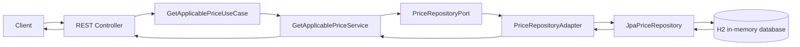
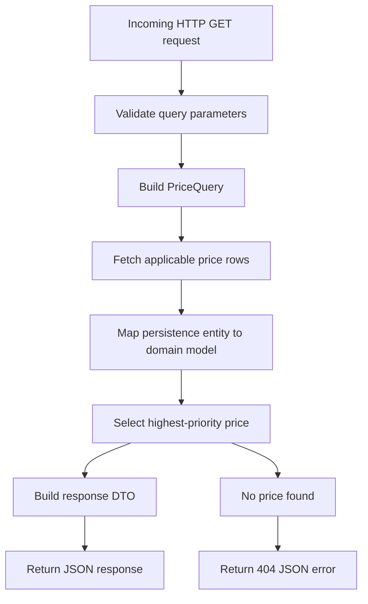

# Price API

A Spring Boot 4 REST service that returns the applicable price for a product based on brand, product identifier, and application date.

## Tech Stack

- Java 21
- Spring Boot 4.0.5
- Maven
- Spring Web
- Spring Data JPA
- H2 in-memory database
- JUnit 5 and MockMvc

## Overview

The service exposes a single REST endpoint that receives:
- an application date
- a product identifier
- a brand identifier

It returns the price rule that must be applied at that moment. When multiple price rules overlap, the service selects the one with the highest priority.

## Architecture

The project follows a simple hexagonal architecture with three main layers:

- domain: core business model and domain exceptions
- application: use case, input/output ports, and application DTOs
- infrastructure: REST adapter, persistence adapter, JPA entities, and configuration-related concerns

### Package Structure

```text
com.ecommerce.priceapi
├── application
│   ├── dto
│   ├── port
│   │   ├── in
│   │   └── out
│   └── service
├── domain
│   ├── exception
│   └── model
└── infrastructure
    └── adapter
        ├── in
        │   └── rest
        └── out
            └── persistence
```

### Request Flow



### Data Flow Diagram



## Business Rule

Each price rule contains:
- a validity window,
- a product id,
- a brand id,
- a price list identifier,
- a priority,
- a final price,
- and a currency.

Selection logic:
- retrieve all price rules that match `brandId`, `productId`, and `applicationDate`
- if more than one rule matches, select the one with the highest `priority`
- if no rule matches, return `404 Not Found`

## REST API

### Endpoint

```http
GET /api/v1/prices
```

### Query Parameters

- `applicationDate`: ISO-8601 date-time, for example `2020-06-14T10:00:00`
- `productId`: product identifier
- `brandId`: brand identifier

### Example Request

```http
GET /api/v1/prices?applicationDate=2020-06-14T10:00:00&productId=35455&brandId=1
```

### Example Success Response

```json
{
  "productId": 35455,
  "brandId": 1,
  "priceList": 1,
  "startDate": "2020-06-14T00:00:00",
  "endDate": "2020-12-31T23:59:59",
  "price": 35.50,
  "currency": "EUR"
}
```

### Example Error Response

```json
{
  "status": 404,
  "error": "Not Found",
  "message": "No applicable price found for brandId=1, productId=99999, applicationDate=2020-06-14T10:00",
  "timestamp": "2026-04-27T00:00:00Z"
}
```

## Database

The application uses an H2 in-memory database initialized from:

- `src/main/resources/schema.sql`
- `src/main/resources/data.sql`

The database is loaded automatically on startup.

### H2 Console

The H2 console is available while the application is running:

- URL: `http://localhost:8080/h2-console`
- JDBC URL: `jdbc:h2:mem:testdb`
- User: `sa`
- Password: `password`

## Running the Application

### Prerequisites

- Java 21
- Maven 3.9+

### Start the service

```bash
./mvnw spring-boot:run
```

Or:

```bash
mvn spring-boot:run
```

The application will start on:

```text
http://localhost:8080
```

## Running Tests

```bash
./mvnw test
```

Or:

```bash
mvn test
```

## Test Coverage

The project includes:

- unit tests for the application use case
- unit coverage for the stream-based highest-priority selection logic
- integration tests for the REST endpoint
- integration coverage for the not-found response

### Required Endpoint Scenarios

The endpoint integration tests validate these scenarios:

1. `2020-06-14T10:00:00` -> price list `1`, price `35.50`
2. `2020-06-14T16:00:00` -> price list `2`, price `25.45`
3. `2020-06-14T21:00:00` -> price list `1`, price `35.50`
4. `2020-06-15T10:00:00` -> price list `3`, price `30.50`
5. `2020-06-16T21:00:00` -> price list `4`, price `38.95`

## Main Design Decisions

- Hexagonal architecture was used to keep business logic independent from framework and persistence details.
- The use case depends on an output port instead of a JPA repository directly.
- The persistence adapter returns domain models, not entities.
- The domain `Price` is modeled as an immutable Java `record`.
- The final price selection is performed in the application layer, where the business rule belongs.
- SQL initialization is explicit and reproducible through `schema.sql` and `data.sql`.
- REST errors are normalized through a dedicated `@RestControllerAdvice`.